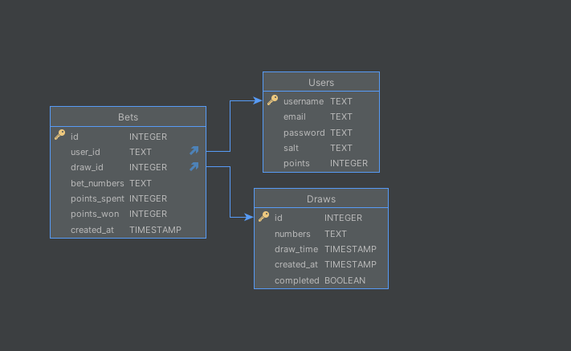
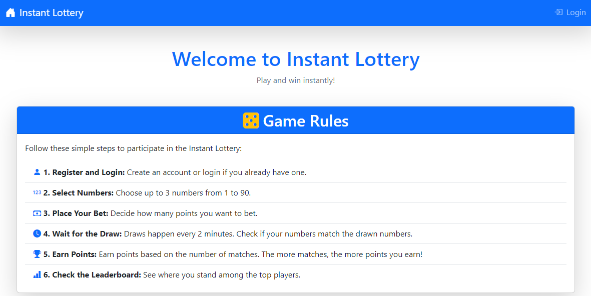
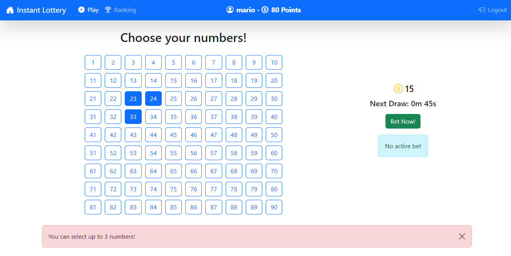
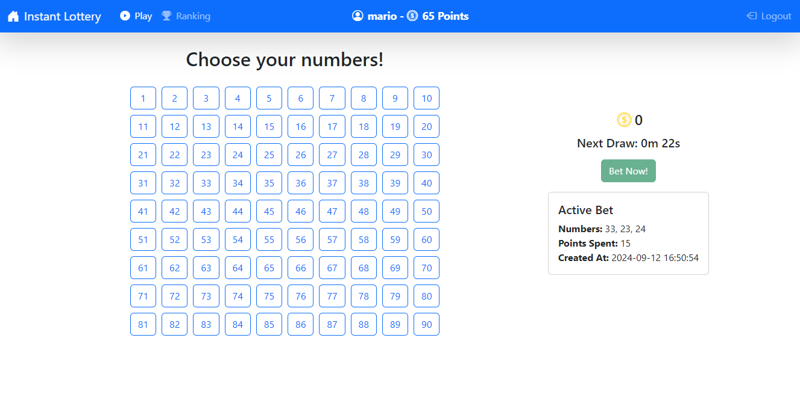
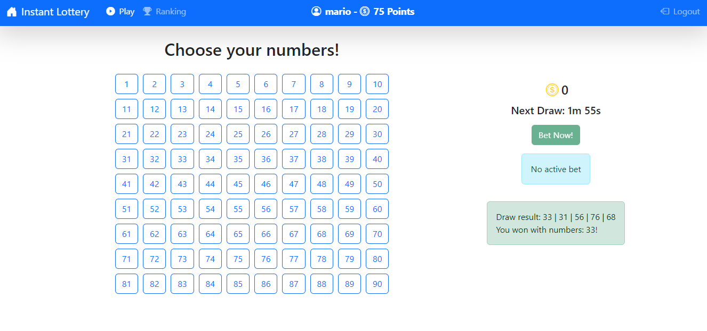
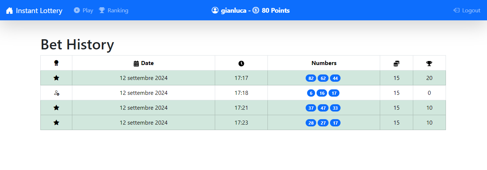

[](https://classroom.github.com/a/1Xsnbbtx)
# Exam #3: "Instant Lottery"
## Student: s331364 VINCI GIANLUCA 

## React Client Application Routes

- Route `/`: Home page, always visible. Contains a summary of the rules.
- Route `/play`: Game page, visible only if logged in. This page allows users to place their bets and check the results.
- Route `/history`: Bet history page, visible only if logged in. This page shows the bet history of the logged-in user.
- Route `/login`: Login page, visible only if not yet logged in. This page allows users to log in.
- Route `/ranking`: Ranking page, visible only if logged in. This page shows the user rankings.
- Route `*`: Not Found page. This page is shown when the user tries to access a non-existent route.


## Main React Components

- `NavHeader` (in `NavHeader.jsx`): This component renders the navigation bar, displaying links to different pages, user information and login/logout button.
- `GamePage` (in `GamePage.jsx`): This component allows users to place their bets, verify the correctness and check the results.
- `BetHistory` (in `BetHistory.jsx`): This component loads and displays the bet history of the logged-in user.
- `LoginPage` (in `LoginPage.jsx`): This component contains the form to perform log in.
- `RankingPage` (in `RankingPage.jsx`): This component loads and displays the user rankings.
- `HomePage` (in `HomePage.jsx`): This component contains a summary of the rules and serves as the main landing page.
- `NotFoundPage` (in `NotFoundPage.jsx`): This component is shown when the user tries to access a non-existent route.


## API Server

### 1. Session Endpoints

#### POST `/api/sessions`

**Description**: Authenticates a user and starts a session.

- **Request Body**:
  ```json
  {
    "username": "exampleUsername",
    "password": "examplePassword"
  }
  ```

- **Response**:
  - `201`: User authenticated successfully. Returns the user object.
  - `401`: Incorrect username or password.

- **Response Body**:
  ```json
  {
    "username": "exampleUsername",
  }
  ```

---

#### GET `/api/sessions/current`

**Description**: Returns the current authenticated user.

- **Response**:
  - `200`: Returns the user object.
  - `401`: No user is authenticated.

---

#### DELETE `/api/sessions/current`

**Description**: Logs out the current authenticated user.

- **Response**:
  - `200`: Logout successful.

---

### 2. Bet Endpoints

#### POST `/api/bets`

**Description**: Allows an authenticated user to place a bet.

- **Request Body**:
  ```json
  {
    "numbers": [1, 2, 3]
  }
  ```

  - **Validations**:
    - User must be authenticated.
    - Numbers must be an array and it must contain between 1 and 3 integers.
    - Numbers must be unique.
    - Each number must be between 1 and 90.

- **Response**:
  - `201`: Bet placed successfully. Returns `{ draw_id: <draw_id> }`.
  - `422`: Validation error (e.g., invalid numbers, more than 3 numbers, duplicate numbers).
  - `500`: Internal server error (e.g. user has already placed a bet for the current draw, insufficient points or now > drawtime). 

---

#### GET `/api/bets/history`

**Description**: Returns the bet history of the authenticated user.

- **Validations**:
  - User must be authenticated.

- **Response**:
  - `200`: Returns the list of bets placed by the user.
  - `500`: Internal server error.

- **Response Body**:
  ```json
  [
    {
        "user_id": "mario",
        "draw_id": 397,
        "bet_numbers": [
            71,
            9,
            29
        ],
        "points_spents": 15,
        "points_won": 30,
        "created_at": "2024-09-10T16:56:25.000Z",
        "id": 73
    }
    ...
  ]
  ```

---

#### GET `/api/bets/active`

**Description**: Returns the active bet (bets related to current active draw) of the authenticated user.

- **Validations**:
  - User must be authenticated.

- **Response**:
  - `200`: Returns the active bet (if any) details.
  - `500`: Internal server error.

- **Response Body**:
  ```json
  [
    {
        "user_id": "mario",
        "bet_numbers": [
            10,
            42
        ],
        "points_spent": 10,
        "created_at": "2024-09-12 16:26:54"
    }
  ]
  ```

---

### 3. Draw Endpoints

#### GET `/api/draws/next`

**Description**: Returns the time of the next scheduled draw.

- **Validations**:
  - User must be authenticated.

- **Response**:
  - `200`: Returns `{ draw_time: "YYYY-MM-DD HH:mm:ss" }`.
  - `404`: No draw available.
  - `500`: Internal server error.

---

#### GET `/api/draws/:id`

**Description**: Returns the draw information by its ID.

- **Validations**:
  - User must be authenticated.

- **Response**:
  - `200`: Returns the draw details (if NOT active).
  - `404`: Draw not found or not yet completed.
  - `500`: Internal server error.

- **Response Body**:
  ```json
  {
    "numbers": [
        16,
        27,
        87,
        35,
        85
    ],
    "created_at": "2024-09-12T14:30:54.000Z",
    "draw_time": "2024-09-12T14:32:54.000Z",
    "completed": true,
    "id": 580
  }
  ```

---

### 4. User Endpoints

#### GET `/api/users/ranking`

**Description**: Returns the ranking of users by points.

- **Validations**:
  - User must be authenticated.

- **Response**:
  - `200`: Returns an array of users sorted by points.
  - `404`: No users available.
  - `500`: Internal server error.

- **Response Body**:
  ```json
  [
    {
        "username": "gianluca",
        "points": 4830
    },
    ...
  ]
  ```

---

#### GET `/api/users/info`

**Description**: Returns the authenticated user's information.

- **Validations**:
  - User must be authenticated.

- **Response**:
  - `200`: Returns `{ username: <username>, points: <points> }`.
  - `404`: User not found.
  - `500`: Internal server error.

## Database Tables

- Table `users` - Contains the username, the point amount and password hash of the users.
- Table `bets` - Tracks the bets placed by the users.
- Table `draws` - Contains extracted number for each draw. Every 2 minutes a new draw is pushed here with the draw_time 2 minutes in the future. 




## Screenshots








## Users Credentials

- gianluca, password
- mario, password
- sara, password
- luigi, password - no bet placed
- piero, password - no bet placed
